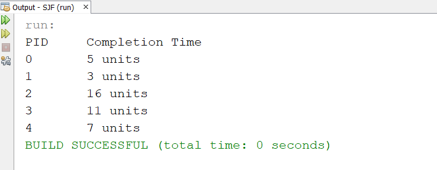

# SJF-Implementation-
SJF algorithm implementation with java code  
# Shortest Job First (SJF) : 
The Shortest Job First (SJF) is a scheduling policy that selects the waiting process with the smallest execution time to execute next. It is also known as Shortest Job Next (SJN) or Shortest Process Next (SPN). It is a non-preemptive scheduling algorithm. 

